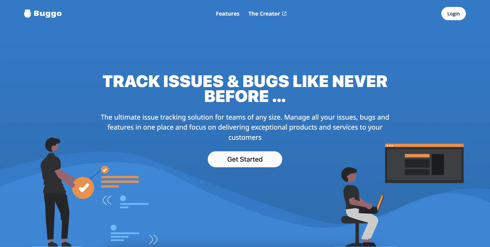

<a name="readme-top"></a>

<div align="center">
  <a href="https://buggo.vercel.app/">
    
  </a>

  <h3 align="center">Buggo</h3>

  <p align="center">
    A real-time issue tracker for small teams.
    <br />
    <br />
    <a href="https://buggo.vercel.app/">View Live</a>
    ·
    <a href="https://github.com/okoyecharles/buggo/issues/new">Report Bug</a>
    ·
    <a href="https://github.com/okoyecharles/buggo/issues/new">Request Feature</a>
  </p>

  <a href="https://github.com/okoyecharles/buggo/actions/workflows/playwright.yml">
    
  </a>
</div>

<details>
  <summary>Table of Contents</summary>
  <ol>
    <li><a href="#about">About</a></li>
    <li><a href="#features">Features</a></li>
    <li><a href="#built-with">Built With</a></li>
    <li>
      <a href="#getting-started">Getting Started</a>
      <ul>
        <li><a href="#prerequisites">Prerequisites</a></li>
        <li><a href="#installation">Installation</a></li>
        <li><a href="#environment-variables">Environment Variables</a></li>
        <li><a href="#running-locally">Running Locally</a></li>
      </ul>
    </li>
    <li><a href="#testing">Testing</a></li>
    <li><a href="#project-structure">Project Structure</a></li>
    <li><a href="#contributing">Contributing</a></li>
    <li><a href="#license">License</a></li>
    <li><a href="#acknowledgments">Acknowledgments</a></li>
  </ol>
</details>

## About

Buggo is a full-stack issue tracker. Teams create projects, invite members, and track tickets from open to closed in one place. Invites, assignments, comments and notifications are delivered live over WebSockets, so everyone sees changes without refreshing.

<div align="center">
  
</div>

<p align="right">(<a href="#readme-top">back to top</a>)</p>

## Features

- **Projects:** create, rename and delete projects, and invite members by name or email
- **Tickets:** track status, priority, type and time estimate, and assign tickets to project members
- **Comments:** discuss tickets with comments that appear live for every member
- **Notifications:** get notified of project invites and ticket assignments in real time
- **My tickets:** see your open, closed, weekly and monthly ticket stats across all projects
- **Admin dashboard:** search users and remove accounts, with changes shown live to every admin
- **Cookie-based auth:** sessions use HTTP-only cookies sent through the Next.js API proxy

<p align="right">(<a href="#readme-top">back to top</a>)</p>

## Built With

**Client**

[![Next.js][next-badge]][next-url]
[![TypeScript][ts-badge]][ts-url]
[![Tailwind CSS][tailwind-badge]][tailwind-url]
[![Redux][redux-badge]][redux-url]
[![Socket.IO][socketio-badge]][socketio-url]

**Server**

[![Node.js][node-badge]][node-url]
[![Express][express-badge]][express-url]
[![MongoDB][mongo-badge]][mongo-url]
[![Socket.IO][socketio-badge]][socketio-url]

**Testing and CI**

[![Playwright][playwright-badge]][playwright-url]
[![GitHub Actions][actions-badge]][actions-url]

<p align="right">(<a href="#readme-top">back to top</a>)</p>

## Getting Started

### Prerequisites

- [Node.js](https://nodejs.org/) (LTS)
- [Yarn](https://classic.yarnpkg.com/) for the client and npm for the server
- A [MongoDB](https://www.mongodb.com/atlas) database

### Installation

```sh
git clone https://github.com/okoyecharles/buggo.git
cd buggo

# Client
cd client
yarn install

# Server
cd ../server
npm install
```

### Environment Variables

Create `client/.env`:

| Variable                 | Description                                  | Example                 |
| ------------------------ | -------------------------------------------- | ----------------------- |
| `API_ORIGIN`             | Server origin that `/api` requests proxy to  | `http://localhost:4000` |
| `NEXT_PUBLIC_SERVER_URL` | Base path for API requests from the browser  | `/api`                  |
| `NEXT_PUBLIC_API_ORIGIN` | Server origin for the WebSocket connection   | `http://localhost:4000` |

Create `server/.env`:

| Variable          | Description                                | Example                 |
| ----------------- | ------------------------------------------ | ----------------------- |
| `MONGO_URI`       | MongoDB connection string                  |                         |
| `JWT_SECRET`      | Secret used to sign auth tokens            |                         |
| `PORT`            | Port the server listens on                 | `4000`                  |
| `ALLOWED_ORIGINS` | Comma-separated origins allowed by CORS    | `http://localhost:3000` |
| `NODE_ENV`        | `development` or `production`              | `development`           |

### Running Locally

Start the server and the client in separate terminals:

```sh
# Server, on http://localhost:4000
cd server
npm run server
```

```sh
# Client, on http://localhost:3000
cd client
yarn dev
```

<p align="right">(<a href="#readme-top">back to top</a>)</p>

## Testing

End-to-end tests are written with [Playwright](https://playwright.dev/) and live in `client/tests`. They cover projects, tickets, live comments and invites, profile editing, ticket stats and the admin dashboard. Playwright starts the client and server automatically.

The tests sign in with existing accounts. Create a regular user and an admin user in your test database, then add their credentials to `client/.env.e2e.local`:

```sh
PW_SETUP_USER_EMAIL=
PW_SETUP_USER_PASSWORD=
PW_SETUP_ADMIN_EMAIL=
PW_SETUP_ADMIN_PASSWORD=
```

Run the suite:

```sh
cd client
yarn playwright test          # headless
yarn playwright test --ui     # interactive UI mode
yarn playwright show-report   # open the last HTML report
```

The suite runs on GitHub Actions for every pull request into `main` and `dev`, and can be started manually from the Actions tab.

<p align="right">(<a href="#readme-top">back to top</a>)</p>

## Project Structure

```
buggo/
├── client/              Next.js app
│   ├── components/      UI components
│   ├── pages/           Routes
│   ├── redux/           Store, actions and reducers
│   └── tests/           Playwright fixtures and specs
├── server/              Express API and Socket.IO server
│   ├── controllers/
│   ├── models/          Mongoose schemas (see server/README.md)
│   └── routes/
└── .github/workflows/   CI
```

<p align="right">(<a href="#readme-top">back to top</a>)</p>

## Contributing

Contributions are welcome. To propose a change:

1. Fork the repository
2. Create a branch from `dev` (`git checkout -b feat/my-feature`)
3. Commit using [Conventional Commits](https://www.conventionalcommits.org/) (`git commit -m "feat: add my feature"`)
4. Push the branch (`git push origin feat/my-feature`)
5. Open a pull request into `dev`

Pull requests must pass the Playwright suite before they can be merged. For larger changes, please open an issue first to discuss the idea.

<p align="right">(<a href="#readme-top">back to top</a>)</p>

## License

Distributed under the MIT License. See [LICENSE](LICENSE) for details.

<p align="right">(<a href="#readme-top">back to top</a>)</p>

## Acknowledgments

- [Discord](https://discord.com/) for the UI design inspiration

<p align="right">(<a href="#readme-top">back to top</a>)</p>

[next-badge]: https://img.shields.io/badge/Next.js-000000?style=for-the-badge&logo=nextdotjs&logoColor=white
[next-url]: https://nextjs.org/
[ts-badge]: https://img.shields.io/badge/TypeScript-3178C6?style=for-the-badge&logo=typescript&logoColor=white
[ts-url]: https://www.typescriptlang.org/
[tailwind-badge]: https://img.shields.io/badge/Tailwind_CSS-38B2AC?style=for-the-badge&logo=tailwindcss&logoColor=white
[tailwind-url]: https://tailwindcss.com/
[redux-badge]: https://img.shields.io/badge/Redux-593D88?style=for-the-badge&logo=redux&logoColor=white
[redux-url]: https://redux.js.org/
[socketio-badge]: https://img.shields.io/badge/Socket.IO-010101?style=for-the-badge&logo=socketdotio&logoColor=white
[socketio-url]: https://socket.io/
[node-badge]: https://img.shields.io/badge/Node.js-339933?style=for-the-badge&logo=nodedotjs&logoColor=white
[node-url]: https://nodejs.org/
[express-badge]: https://img.shields.io/badge/Express-404D59?style=for-the-badge&logo=express&logoColor=white
[express-url]: https://expressjs.com/
[mongo-badge]: https://img.shields.io/badge/MongoDB-47A248?style=for-the-badge&logo=mongodb&logoColor=white
[mongo-url]: https://www.mongodb.com/
[playwright-badge]: https://img.shields.io/badge/Playwright-2EAD33?style=for-the-badge&logo=playwright&logoColor=white
[playwright-url]: https://playwright.dev/
[actions-badge]: https://img.shields.io/badge/GitHub_Actions-2088FF?style=for-the-badge&logo=githubactions&logoColor=white
[actions-url]: https://github.com/features/actions
