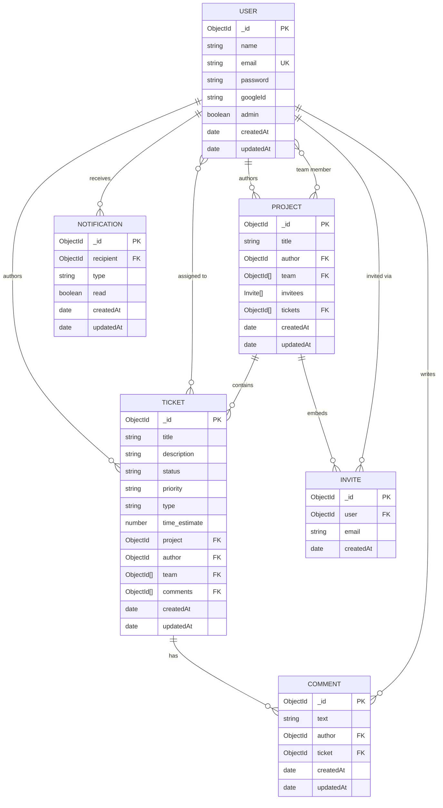
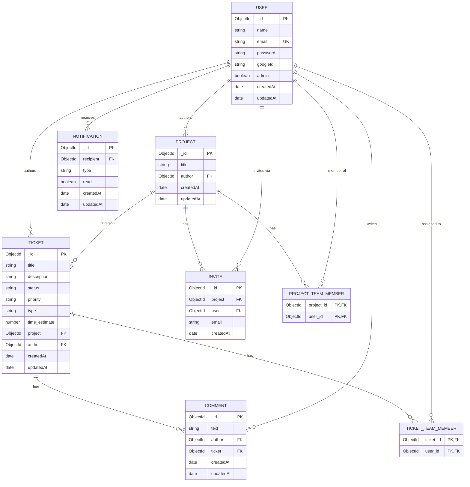

### Buggo Database Schema

Below represents the database schema for Buggo. This schema is subject to change as the project evolves.

Relational (SQL) equivalent, for readers less familiar with MongoDB's document model

`team` and `invitees` are stored as embedded arrays in MongoDB, not separate tables. This view represents the same data normalized into join tables, the shape it would take in a relational database.

### Buggo API Endpoints

Below represents the API endpoints for Buggo. These enpoints are subject to change as the project evolves.

Every endpoint requires a valid token except `health`, `users/signup`, `users/signin` and `users/signout`.

| Endpoint (`/api/`) | Method | Description |
| :--- | :--- | :--- |
| health | **GET** | Check that the api is up |
| users | **GET** | Get all users |
| users/validate | **POST** | Validate a user token |
| users/signup | **POST** | Create a user |
| users/signin | **POST** | Authenticate a user |
| users/signout | **POST** | Clear the session cookie |
| users/:id | **PUT** | Update a user |
| users/:id | **DELETE** | Delete a user |
| projects | **GET** | Get every project the user is part of |
| projects/:id | **GET** | Get a project by id |
| projects | **POST** | Create a project |
| projects/:id | **PUT** | Update a project |
| projects/:id | **DELETE** | Delete a project |
| projects/:id/invite | **PUT** | Invite users to a project |
| projects/:id/accept-invite | **PUT** | Accept an invite to a project |
| projects/:id/decline-invite | **PUT** | Decline an invite to a project |
| projects/:id/tickets | **POST** | Create a ticket on a project |
| tickets | **GET** | Get every ticket the user created |
| tickets/:id | **GET** | Get a ticket by id |
| tickets/:id | **PUT** | Update a ticket |
| tickets/:id | **DELETE** | Delete a ticket |
| tickets/:id/comments | **POST** | Create a comment on a ticket |
| tickets/:id/comments/:commentId | **GET** | Get a comment on a ticket |
| notifications | **GET** | Get the user's notifications, newest first |
| notifications/read | **PATCH** | Mark every notification as read |
| notifications/:id/read | **PATCH** | Mark a notification as read |
| notifications/:id | **DELETE** | Dismiss a notification |
